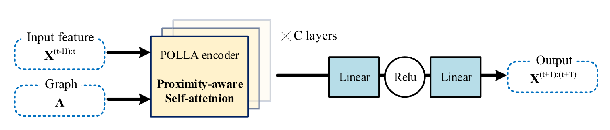

# POLLA
> Enhancing the Local Structure Awareness in Long Sequence Spatial-temporal Modeling（增强长序列时空建模中的局部结构感知）

This is the pytorch implemention of [POLLA: Enhancing the Local Structure Awareness in Long Sequence Spatial-temporal Modeling](https://dl.acm.org/doi/10.1145/3447987)

### 模型介绍
This repository contains the code and documentation for the paper "POLLA: Enhancing the Local Structure Awareness in Long Sequence Spatial-temporal Modeling" by Haoyi Zhou.

文章《POLLA》介绍了一种改进时空预测任务的新方法，即基于邻近感知的长序列学习框架——POLLA。POLLA 通过注意力分数的线性近似增强了建立长期依赖的局部结构线索。该模型利用relief邻接矩阵技术和简化的解码器进行快速推理，在大规模数据集上实现了最先进的性能。



#### POLLA主要特点
- Proximity-aware Attention mechanism for capturing local structure information.
- Relief adjacency matrix for utilizing historical global graph information.
- Reduced decoder for fast, non-autoregressive inference.
- State-of-the-art performance on long sequence spatial-temporal forecasting tasks.

### 数据集
该论文在如下几个数据集测试POLLA模型：
- METR-LA：Contains loop detector records of 207 sensors in Los Angeles County.
- PEMS-BAY: Contains speed records of 325 sensors in the Bay area.

这两个数据集预测交通速度，下面三个数据集重点预测交通流量
- PEMS-03/04/08: Contains flow records of sensors in three different districts during different seasons.

数据集文件路径如下：
> - POLLA/data/metr-la.h5 
> - POLLA/data/sensor_graph/adj_mx.pkl
 

#### 交通速度预测任务
使用60分钟的历史窗口预测未来15、30和60分钟的交通状况，并将训练/验证/测试集拆分为整个数据集的70%/10%/20%。预测窗口从短期视野上升到长期视野，体现了考虑任务难度的预测能力。

#### 交通流量预测任务
使用之前的60分钟数据来预测未来的60分钟数据，并将训练集/验证集/测试集分割为整个数据集的60%/20%/20%。

### 依赖库
- Python==3.6.4
- matplotlib==3.1.1
- numpy==1.19.4
- pandas==0.25.1
- scikit_learn==0.21.3
- torch==1.8.0
- tables==3.7.0

### 运行方法

```python
python main_polla_exp.py --model polladiff --data metr --seq_len 12 --pred_len 12 --d_model 64 --n_layers 3 --n_heads 8 --d_ff 256 --train_epochs 4 --patience 10 --itr 2 --loss mae
```

#### Code Structure
- polla/
  - data/          # Code for loading and preprocessing datasets and datasets used in experiment.
  - exp/           # Experiment functions.
  - models/            # POLLA model definition.
  - util/             # Utility functions.
- main_polla_exp.py   # Execute function.
- README.md           # This file.
- requirements.txt    # List of required packages.

### 运行结果


