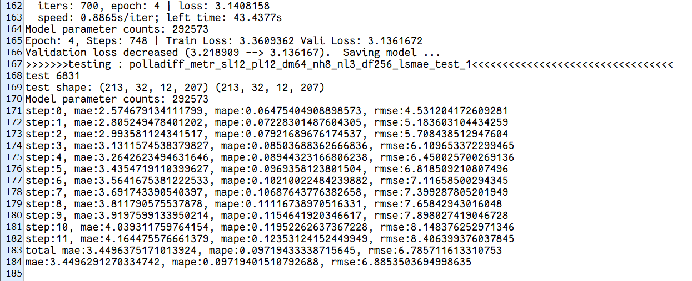

# POLLA
pytorch implemention of [POLLA: Enhancing the Local Structure Awareness in Long Sequence Spatial-temporal Modeling](https://dl.acm.org/doi/10.1145/3447987)
## 论文复现
### 依赖库
- Python==3.6.4
- matplotlib==3.1.1
- numpy==1.19.4
- pandas==0.25.1
- scikit_learn==0.21.3
- torch==1.8.0
- tables==3.7.0
### 数据集
- METR-LA

### 运行方法

```python
python main_polla_exp.py --model polladiff --data metr --seq_len 12 --pred_len 12 --d_model 64 --n_layers 3 --n_heads 8 --d_ff 256 --train_epochs 4 --patience 10 --itr 2 --loss mae
```

### 运行结果


