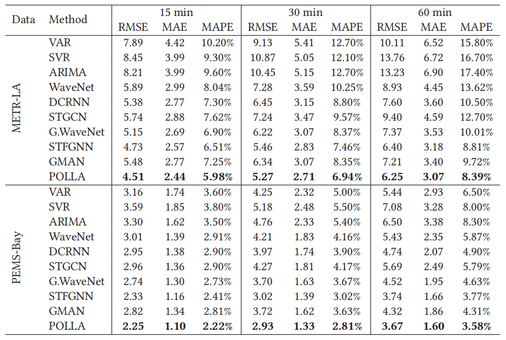

# POLLA
> Enhancing the Local Structure Awareness in Long Sequence Spatial-temporal Modeling（增强长序列时空建模中的局部结构感知）

原文链接：[POLLA: Enhancing the Local Structure Awareness in Long Sequence Spatial-temporal Modeling](https://dl.acm.org/doi/10.1145/3447987)

### 模型介绍
文章《POLLA》介绍了一种改进时空预测任务的新方法，即基于邻近感知的长序列学习框架——POLLA。**POLLA** 是一种创新的时空预测框架，专为长序列数据设计，旨在增强模型对局部结构信息的理解。本框架通过提出邻近感知注意力机制（Proximity-aware Attention），在捕捉复杂时空依赖时，有效利用局部结构线索。它采用线性近似注意力得分，从而在构建长程依赖关系时增强对局部结构的利用。此外，模型还引入了**缓解邻接矩阵技术**，能够利用历史全局图信息以保持序列中变化的局部结构学习一致性。为了加速推理过程，POLLA采用了一个简化版的解码器，支持非自回归式预测，显著提高了预测效率。该模型还利用relief邻接矩阵技术和简化的解码器进行快速推理，在大规模数据集上实现了最先进的性能。


#### POLLA主要特点
- 用于捕获局部结构信息的邻近感知注意机制。
- 用于利用历史全局图信息的缓解邻接矩阵。
- 用于快速、非自回归推理的简化解码器。
- 在长序列时空预测任务上具有最先进的性能。

### 数据集
POLLA 模型在多个大规模数据集上进行了验证，包括：

- **METR-LA**: 包含洛杉矶县207个传感器的环路检测记录，用于预测交通速度。
- **PEMS-BAY**: 含有湾区325个传感器的交通速度记录。
- **PEMS-03/04/08**: 分别包含不同季节里三个不同区域的交通流量记录。

这些数据集覆盖了交通速度和流量预测，为POLLA提供了全面的评估场景。

数据集文件路径如下：
> - POLLA/data/metr-la.h5 
> - POLLA/data/sensor_graph/adj_mx.pkl


#### 交通速度预测任务
对于使用60分钟的历史窗口预测未来15、30和60分钟的交通状况的问题，将训练/验证/测试集拆分为整个数据集的70%/10%/20%；对于使用之前的60分钟数据来预测未来的60分钟数据的问题，将训练集/验证集/测试集分割为整个数据集的60%/20%/20%。

### 依赖库
- python==3.6.4
- matplotlib==3.1.1
- numpy==1.19.4
- pandas==0.25.1
- scikit_learn==0.21.3
- torch==1.8.0
- tables==3.7.0

### 运行方法

```python
python main_polla_exp.py --model polladiff --data metr --seq_len 12 --pred_len 12 --d_model 64 --n_layers 3 --n_heads 8 --d_ff 256 --train_epochs 4 --patience 10 --itr 2 --loss mae
```

### 实验结果



POLLA 在大规模数据集上的实验表明其性能优越，达到了当前最优水平。具体亮点包括：

- **预测精度**：与Graph WaveNet和GMAN相比，POLLA能更准确地预测交通速度，尤其是在交通高峰时段速度突变时，如晚上20:00后的交通速度突然上升，POLLA是唯一能捕捉这一趋势的方法。
- **鲁棒性**：在“高峰小时”（例如，2017年一个繁忙周五的13:00至19:00）交通流预测中，POLLA对于速度突降及“上下波动”模式的预测更为准确，其他模型则存在时间滞后现象。
- **计算效率**：在PEMS-BAY数据集的验证集上，POLLA的训练和推理时间远低于其他大型神经网络模型，如DCRNN、STGCN、Graph WaveNet等，显示了其高效性。

### 运行结果

在`METR-LA`数据集上运行结果如下所示：


